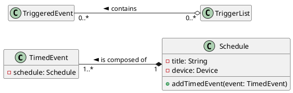
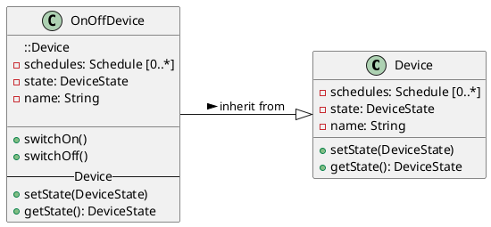
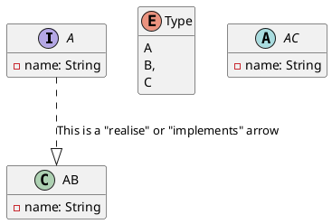
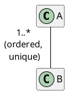
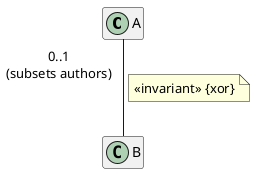
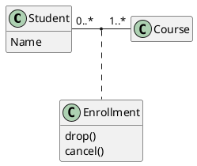

# Class Diagrams

Link to [Class Diagrams in plantuml](https://plantuml.com/de/class-diagram)

## Composition and Aggregation

### Composition

- Composition is the strong whole-part relationship
- If a class is composed of others, deleting an instance of the whole results in deletion of the instances of the parts

### Aggregation

- Aggregation is the weaker whole-part relationship
- If a class is an aggreation of others, deleting instances of the whole leaves the instances of the parts untouched

## Generalization and Specialization

- inheritance in object-oriented systems
- Generalization/specialization notation
- Attributes and operations

## Advanced Class Diagram Notation

### Modelling at different Levels

- Domain modelling ~ _less detail_
  - High-level view
  - Governance
- Analysis and design ~ _more detail_
  - Requirements for COTS
  - Moving towards implementation
- Programming ~ _most detail_
  - Generating code from models

> Modelling, is to model with a purpose, don't produce models or diagrams for the sake of it. They need to provide some value to the organisation or project and don't use unnecessary features or detail if they're not required.

### Interfaces and Enumeration

### Advanced Associations

- Constraints
- Ownership
- AssociationClass

#### Constraints

- Two constraints apply to the multiplicity: _ordered_ and _unique_

- Other constraints can be added, usually shown alongside the association role or in a note

#### Ownership

- The role at the end of an association can be owned by the class at the opposite end or by the association
- this is shown by a black dot at the end of the association

#### Association Classes

- An association may hold data as well as owning the association ends
- A class can be linked to the association with attributes to hold the required data

