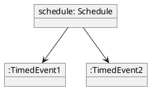
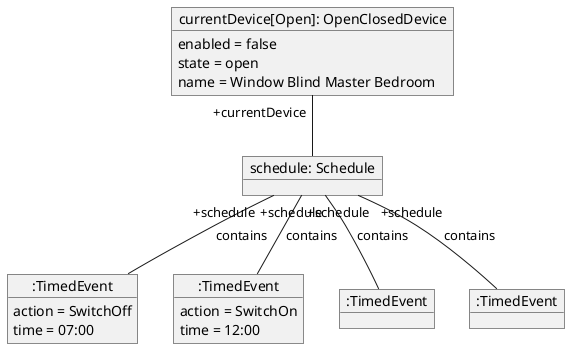

# Object Diagrams

## Purpose

- Model the things in the problem domain before classifiying them as classes
- Model how state changes in response to events of activities
- Reason about objects that will exist at run-time and how they will interact with one another using sequence or communication diagrams

## State

- Objects change over time
- Operations change attribute values and links
- Some changes are significant and represent changes of state

## Attributes and State

- Attribute values can be shown in an object diagram to illustrate change to state
- The values are held in slots, which represent attributes in the class diagram

