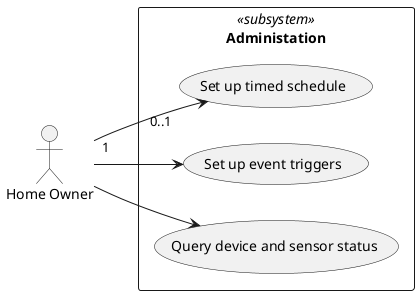
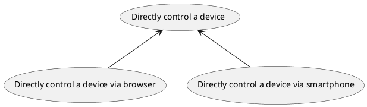
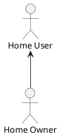
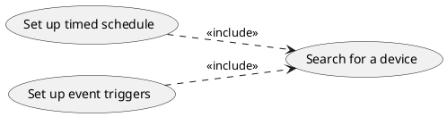
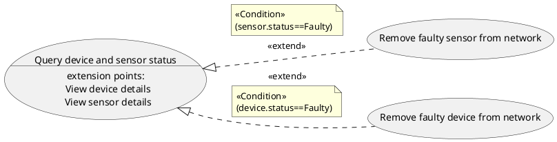

# Use Case Diagrams

## Purpose

- Provide a high level view of the system
- Document user requirements
- Explore alternative scenarios
- Provide a start point for analysis of classes (robustness analysis)
- Help to define the user interface
- Support project managment
- Form a basis of testing

### High Level View of the System

- Summarize the functionality and provide a way of determining the scope
- Provide a tool for communication with users about the goals of the system

### User Requirements

- Use cases organize the requirements from the users' point of view
- A recipe - not a list of ingredients

### Exploring Alternative Scenarios

- What can go wrong?
- What alternative ways are there of working through the use case

### Starting Point for Class Analysis

- The use cases are the starting point for working out what classes are required in the system to implement the functionality
- This approach is known as robustness analysis

### Help to define the User Interface

- Use cases describe how the users will use the system
- They are a starting point for user interface or user experience design

### Used in Project Management

- Architects and project managers use the use cases to plan the project and manage rist
  - estimating, costing and planning
  - organizing the incremental development and delivery of the system

### Basis for testing

- Use cases describe how the system will be used
- Test cases can be written for each use case and each alternative or error path through that use case

## Notion of Use Case Diagrams

### Subjects

- A subject of a UseCase could be a system or any other elemtn that may have behavior, such as a Component or Class
- Usually use cases are created early in project
- Informally subject represents a subsystem

### Use Cases

- Use cases represent some behavior that a subject can perform in collaboration with one or more actors
- Shown as an ellipse with the name in or below the ellipse

### Actors

- Roles played by people or external systems in relation to the system
- The actor interacts with the use case usually to achive some goal
- Primary and secondary actors

### Associations

- Relationships that show how actors are associated to use cases
- Associations can have multiplicities, but these are rarely used



## Relationships in Use Case Diagrams

- Generalization/Specialization
- Include
- Extend

### Generalization/Specialization

- Use cases can have inheritance relationships with other use cases
- One use case defines the general case and other use cases define specializations of that use case



- Actors can have inheritance relationships with other actors
- The specialized actor inherits all the associations with use cases of the more general actor



### Include Relationship

- The behaviour of one use case includes the behaviour of another use case at one point
- Shown using a dashed arrow with the stereotype <<include>>
- Arrow to included use case



### Extend Relationship

- The behaviour of one use case is conditionally included in another use case at one or more points
- Shown using a dashed arrow with the stereotype <<extend>>
- Arrow to extended use case



## Specifying Use Cases

- Use cases with no actors
- Specifying behaviour
- Activity diagrams
- Use case descriptions

### Use Cases with no Actors

- When the Home Automation system is running, it will perform behaviours with no human intervention (e.g. by time or temperature)
- You could show a use case _Perform device action_ with no actor

- Some peoply would add actors like _Sensor_ or _Time_

  - Are these really actors?
  - What observable result of value are they getting from the system?
  - They are parts of the system itself

- We need to distinguish actors from triggers
- Actors gain value from use cases
- Triggers initiate use cases
- Triggers are part of the specification of use cases

### Specifying Behaviour

- If you think that use cases are just a visual notation, then you are missing the point and failing to get value from them
- Additional information specifies the use case

### Activity Diagrams

- A use case can be specified graphically using one or more activity diagrams or sequence diagrams
- Activity diagram shows the steps in the use case and alternative scenarios as branches

### Use Case Descriptions

- Textual descriptions (e.g. a Jira Ticket) of the steps in a use case

```md
Use Case: Add a device

1. The user selects Add Device from the menu
2. The system presents the screen allowing them to add a device
3. The user enters the name of the device
4. The user selects the type of the device
5. The user browses to the location of the device driver ...
```

- Typically use a template (Name, goal, steps, primary-, secondary actor, ...)
- Document the main scenario and alternative and exception scenarios
- Some tools provide scenario editors for use cases
- Allow step-by-step specification of user actions and system responses
