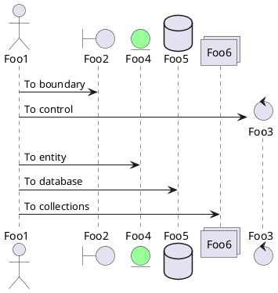
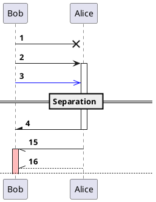
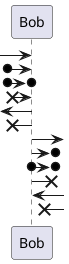
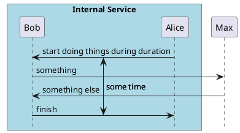
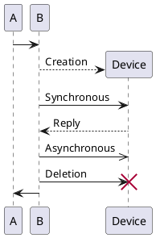
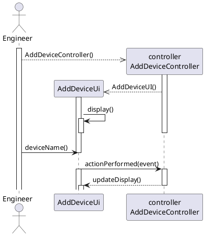
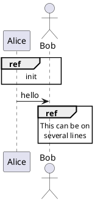
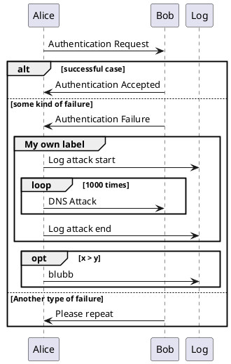

# Sequence Diagrams

## Purpose of Sequence Diagrams

- Provide a view of the interaction between elements of the system at a number of different levels
- Support use cases by specifiying the detailed interaction
- Explore alternative scenarios in more detail
- Anylse interaction in tests

### Interaction in the system

- Model interaction at different levels:
  - Components or subsystems
  - Active Objects
  - Within a use case
  - Within an operation

### Specify Use Case Interaction

- Shows the detailed interaction to support a use case:
  - At the user interface
  - Among other objects

### Explore alternative scenarios

- Different sequence diagrams can be produced for different instances of a use case
- Sequence diagrams can include alternative paths through the interaction

### Analyses interaction in tests

- A debugger stack trace can be converted to a sequence diagram and compared with the design

## Basic Notation of Sequence Diagrams

- Lifelines
- Messages
- Signals
- Execution Specification

```plantuml
@startuml
skinparam sequence {
	ArrowColor DeepSkyBlue
	ActorBorderColor DeepSkyBlue
	LifeLineBorderColor blue
	LifeLineBackgroundColor #A9DCDF

	ParticipantBorderColor DeepSkyBlue
	ParticipantBackgroundColor DodgerBlue
	ParticipantFontName Impact
	ParticipantFontSize 17
	ParticipantFontColor #A9DCDF

	ActorBackgroundColor aqua
	ActorFontColor DeepSkyBlue
	ActorFontSize 17
	ActorFontName Aapex
}
header Page Header
footer Page %page% of %lastpage%

title Example Title

Alice -> Bob : message 1
Alice -> Bob : message 2

@enduml
```

### Lifelines

- Represent instances, usually of objects, in an interaction
- Rectangle with name of object
- Line down the page, usually dashed
- Also used for actor
- Time in a sequence diagram runs down the page
- Distance between two events does not represent a literal difference in time (no scale)

### Messages

- Lifelines sind and receive messages or signals
- Message types

### Execution Specifications

- Shown as a rectangle on the lifeline
- Represent the execution of code by the object

### Active Objects

- Active objects are instances of classes flagged as Active
- Active objects execute their behaviour as soon as they are created
- Run on own thread of control
- Lifelines have two lines at the sides

- States can also be displayed in sequence diagrams as a ellipse on the lifeline

## Timing and Duration Constraints

- Observations
  - Time
  - Duration
- Constraints
  - Time
  - Duration
- Allow message to slant down

## Interaction Occurrences

- Reusable sequence diagrams
- Interaction occurrences
- Referencing interaction occurrences
- Gates

### Reusable Sequence Diagrams

- Sequence diagrams can very quickly get very complex
- This diagram has been deliberately simplified
- Interaction occurrences allow us to put parts of a diagram into a separate diagram to simplify the main diagrams and make them more manageable
- These are called interaction occurrences
- Ideally they should be reusable in other diagrams

**Referencing Occurrences**

- Frame with _ref_ in the top left and the name of the interaction occurrences that is being referenced in the center

### Gates

- Where messages go into or come out of an interaction occurrence there is a gate
- Gates must match the containing diagram

## Combined Fragments

- Keywords in plantuml
  - alt/else
  - opt
  - loop
  - par
  - break
  - critical
  - group, gefolgt von einem anzuzeigenden Text

