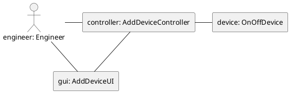
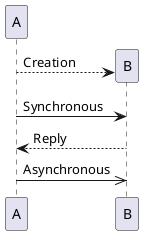
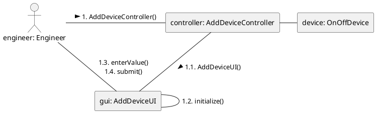

# Communication Diagrams

## Purpose

- Provide a view of the interaction between elements of the system at a number of different levels
- Analyze use cases by specifiying the detailed interaction
- Analyze the classes and the operations required to implement a use case

### Interaction in the System

- Model interaction at different levels:
  - Components or subsystems
  - Active objects
  - Within a use case
  - Within an operation

### Analyzing use case interaction

- Shows the dtailed interaction to support a use case:
  - At the user interface
  - Among other objects

### Build up Class Diagrams

- By modeling the interaction between classes in communication diagrams we get a view that is similar to the class diagram view
- These can be consolidated into a larger class diagram

## Basic Notation of Communcation Diagrams

_(plantuml does not support a special notation for these kind of diagrams)_

- Communication Diagrams
- Lifelines
- Links
- Messages

- Communcation diagrams correspond to simple sequence diagrams
- Communcation diagrams do not have structural elements like interaction occurrences and combined fragments
- Communcation diagrams are used where the internal structure and its relationship to message passing is central

### Lifelines

- Lifelines in communcation diagarms have the same notation as sequence diagrams without the dashed line down the page
- Represent instances, usually of objects in an interaction, including actors
- Names are most commonly
  - name of an object possibly as an element of a colleciton
    - device
    - events[i]
  - name of a class, interface or other type
    - :OnOffDevice
    - :TimedEvent
  - name of object and type
    - device:OnOffDevice
    - events[i]:TimedEvent

### Links

- Lifelines are joined to one another by connectors that represent the paths messages can follow
- Equivalent to links in object diagrams



### Messages

- Lifelines send and receive messages or signals, which are shown alongside the links with the message name
- Message types



- Sequence of messages is shown by a sequence expression before the message name
- Numbering sequence separated by "." & optional condition

- the message names can be informal during analysis, e.g.
  - Change dates
- Formally should be:

```text
<message-label> ::= <request-message-label> | <reply-message-label> | '*'
```

- Either a request message or a reply message or \*



- In UML specification (but not in plantuml) you can also add the following to communcation diagrams
  - Loops
  - Conditions
  - Numbering
  - Additional Notation
- This is done by a specific format of the message string
