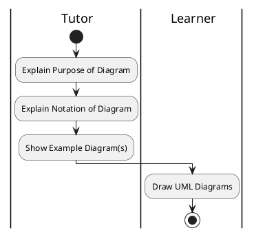
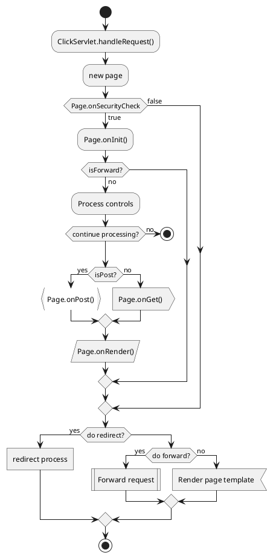
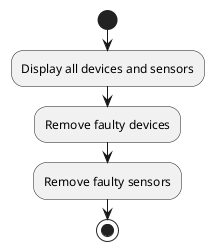
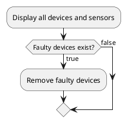
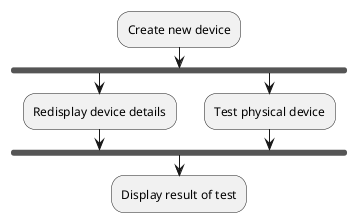
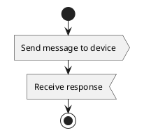

# Activity Diagrams

## Purpose

- Model processes or procedures
- Provide a picture of high-level or end-to-end business processes
- Model business workflows with swimlanes
- Analyze the activites that take place as part of the execution of a use case
- Document an algorithm, possibly the method body of an operation

### End-To-End Business Processes

- Model business processes at high level, showing the steps from end-to-end
- Provide a context for use cases that implement some of those steps

### Model Workflows with Swimlanes

- Shows the participants in the activity and the specific activites or actions they are responsible for
- Participants can be people, organizational units or systems



### Analyze Activities in a Use Case

- The steps in a use case can be visualized as an activity diagram
- Some tools generate the activity diagram directly from the use case scenario

### Specify an Algorithm

- An activity diagram can show an algorithm either using a general flowchart style of notation or using specific types of action like:
  - WriteVariableAction
  - CallAction
  - CreateObjectAction

## Basic Notation

- Workflow
- Activity
- Initial and Final Nodes
- Actions and Activities
- Control Flow

### Plantuml



### Workflow

- Activity diagrams are used to model workflows as a series of connected actions, some of which are themselves activities
- They show control nodes, executable nodes and object nodes

### Activity

- Round-cornered rectangle with name of the top
- Often implied or missed out in diagrams (Background)

### Initial and Final Nodes

- Initial -- solid black circle
- Final -- circle with smaller black circle inside
- Types of control nodes

### Actions and Activities

- In round-cornered rectangles
- Named to describe the action or activity
- Action are the fundamental units of behaviour
- Actions are executable nodes
- Technically, activities are only shown in activity diagrams as part of the workflow if they are structured activities, which are a kind of action
- Use (structured) activities for large scale behaviours
- Business process activities or activities in a use case

- Use action for lowest level behaviours
- Specification of operations

### Control Flows

- Arrows connection actions
- Open arrow-heads
- Same approach for actions as for activities



## Decisions
- Decisions and merges
- Conditions and guards
- Not using decision nodes

### Decisions and Merges
- At points in the workflow of an activity diagram, the workflow can branch based on conditions
- In UML, the flow branches at a decision node and merges at a merge node
- Both are shown as diamonds
- The decision usually has the condition in or near it
- The flows out of the decision are marked with guards



### Not Using Decision Nodes
- Guards on outputs from an activity or action
- Still need smoehwere to merge
- Less clear to the reader

## Parallel Flows in Activity Diagrams
- Parallel workflows
- Forks and Joins
- Not using fork and join nodes
- Token passing
- Flow final node

### Parallel Workflows
- In business processes, activity can take place in parallel
- In computerized systems, activites run concurrently, on separate servers, processes or threads
- These are shown in an activity diagram as parallel flows
- The workflow forks at a ford node and rejoins at a join node
- Both are shown as bars in the diagram

### Forks and Joins


### Not Using Fork and Join Nodes
- implicit fork and join

```plantuml
:create new device;
split
	:Redisplay device details;
split again
	:Test physical device;
end split
:Display result of test;
```

### Token Passing
- Activity diagrams use the concept of token passing from Petri nets

*From Influx experience: Like BPMN Token*

### Flow Final Node
- Sometimes in parallel flows, a flow comes to an end without terminating the whole activity
- Flow final node
- Shown as an X in a circle

```plantuml
repeat
	:Display list of devices in room;
	:Select device;
	:Control device;
	fork
		:Send control message to device;
		end
	fork again
		:Prompt for next action;
	end fork
repeat while (action=AnotherDevice)
-> else;
stop
```

## Swimlanes in Activity Diagrams
- Showing responsibilities
- Partitioning an activity
- Swimlanes

### Showing Responsibilities
- In business processes, different people, roles, departments or organizations can be responsible for activities or action in a workflow
- In computerized systems, differnt classes, sub-systems or components may be responsible for actions or activites
- We can show this in an activity diagram with swimlanes

### Swimlanes
- Shown vertically or horizontally
- Name at the top or left

```plantuml
|U| User
|S| System

|S|
start
:Display Device entry screen;
|U|
:Enter device details and submit;
|S|
:Create new device;
fork
	:Redisplay device details;
fork again
	:Test physical device;
end fork
:Display test result;
stop;
```

## Object and Object Flows
- Showing objects in activity diagrams
- Object flowsn
- Pins on actions

### Showing Objects
- Actions have effects on objects, and these can be shown in activity diagrams
- Like lifelines in communication diagrams
```txt
<name>':'<classifier>
```
- Can optionally show the state of the object in square brackets

```plantuml
object device: OnOffDevice {}
object device: OnOffDevice [Off] {}
```

### Object Flows
- Object flows connect objects to activities and actions
- Also connect them to other elements such as central buffers and data stores, which hold objects temporarily or persistently
- The flow in an activity diagram can go via object flows as well as or instead of control flows
- Shown using the same notation as control flows

### Pins
- Where an object isn't the source or target of an object flow, a pin must be added
- Pins are shown as a small square on the edge of an activity
- Name is the object and classifier separated by ':'
- Pins are used particularly on actions, which are of different types that operate on objects

## Structured Activities
- Activities decomposed
- Activities parameters
- Actions in activities
- Interruptible regions

### Activities Decomposed
- We can take an activity at on elevel, and if we need to show the detail of the workflow within it, decompose it as a structured activity

### Activity Parameters
- Shown on the edge of the activity
- Represent values passed into and out of the activity

### Actions in Activities
- At the lowest level that we need to go to we show actions in activities
- Values are passed in and out as object flows from and to activity parameters

### Interruptible Regions
- Interruptible regions group action that can be interrupted by an event
- Shwon as a dashed roundcornered rectangle around the actions
- Include an event/action that interrupts
- Flow out shown as a zig-zag arrow

## Send, Receive and Timers
- Send and receive actions
- Signals
- Timers

### Send and receive actions
- Send - SendSignalAction
- Used to show the sending of signals
- Receive - Accept Event Action
- Used to show the receipt of signals



### Signals
- Sent by a SendSignalAction
- Received by an AcceptEventAction
- Object whose classifier is a signal

### Timers
- Timer - AcceptTimeEventAction
- Used to show time triggered events in activity diagrams