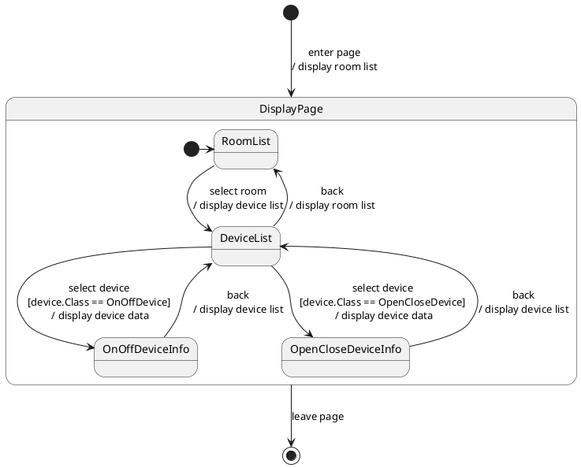
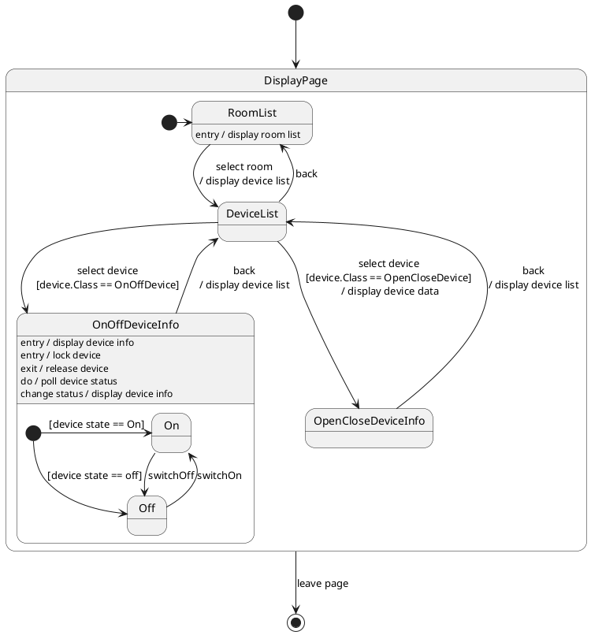
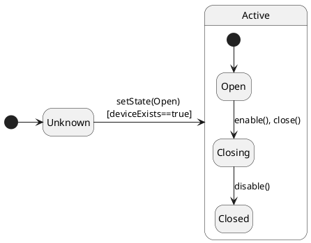

# State Machine Diagrams

## Purpose
- Origins and types
- Model behaviours in terms of the states they pass through, the events that trigger changes and the actions that are carried out
- Ensure an understanding of important state-dependent behaviour
- Analyze and model changes to state of key classes over time

### Origins and Types
- State machine diagrams are based on David Harel's Statechart notation
- Two types of state machine in UML:
    - Behaviour state machines - model behaviour that passes through a number states
    - Protocol state machines - model the usage protocol of a classifier - the legal ways of invoking its features

### State-Dependent Behaviour
- Some classes in some systems have behaviour that is very dependent on the state that hey are in
- They may respond very differently to message when they are in different states
- Objects may have state that changes over their lifetime, whether long-lived or short-lived

### Model Behaviours
- Behaviour state machine

### Model State changes of Classes
- Protocol state machine
- Shows the legal sequence of state changes for a class
- Provides a usage protocol to users of the services of the class

## Basic Notation
- Behaviour State Machines
- States
- Transitions
- Initial Pseudostate
- Final State

### States
- A situation during which some invariant condition holds
- Shown in a round-cornered rectangle
- Name may be in a tab on top
- Usually named with a capital letter

### Transitions
- Represent the change from one state to another
- Shown by an arrow between states with an optional label
- Triggered by one or more events
- May have a guard condition
- May have behaviours associated with it

```text
[<trigger>[','<trigger>]*['['<guard>']']['/'<behavior-expression>]]

e.g.
select device [device.Class == OnOffDevice]/display device data
```

### Trigger
- Trigger may be one of:
    - Call event - name of an operation
    - Signal event - name of a signal
    - Any receive event - 'all'
    - Change event - when a Boolean condition changes
    - Time Event
        - Relative time event - after a time
        - Absolute time event - at a time

### Initial and Final
- initial pseudostate
    - Shown as a black filled circle
- Final state
    - Shown as a black filled circle inside a black circle with white inside it



## Behaviours in States
- Entry behaviours
- Exit behaviours
- DoActivity behaviours
- Triggers

### Entry behaviours
- Behaviours carried out when a state is entered
- Not required on transitions into that state
- Labelled with `entry /` followed by the name of the behaviour

```plantuml
[*] -> RoomList: enter page
RoomList: entry / display room list
RoomList --> DeviceList: select room
DeviceList --> RoomList: back
DeviceList: entry / display device list
```

### Exit behaviours
- Behaviours carried out when a state is exited
- Not required on transitions from that state
- Labelled with `exit /` followed by the name of the behaviour

```plantuml
state "OnOffDeviceInfo"  as OODI
OODI: entry / lock device
OODI: exit / release device
```

### DoActivity Behaviours
- Behaviours carried out while in a state
- Labelled with `do /` followed by the name of the behaviour

```plantuml
state "OnOffDeviceInfo"  as OODI
OODI: entry / lock device
OODI: exit / release device
OODI: do / poll device status
```

### Triggers
- Triggers that don't change state but result in behaviour
- Labelled with trigger '/' followed by the name of the behaviour

```plantuml
state "OnOffDeviceInfo"  as OODI
OODI: entry / lock device
OODI: exit / release device
OODI: do / poll device status
OODI: change status / display device info
```

### Example


## Pseudostates
- Choice pseudostate
- Junction pseudostate
- History pseudostate

### Choice Pseudostate
- Allows a transition to be split based on guard conditions
- Guards evaluated dynamically when pseudostate is reached

```plantuml
state fork_state <<fork>>

DeviceList --> fork_state : select device
fork_state --> OnOffDeviceInfo : [device.Class == OnOffDevice]
fork_state --> OpenClosedDeviceInfo: [device.Class == OpenClosedDevice]
OnOffDeviceInfo -up-> DeviceList : back
OpenClosedDeviceInfo -up-> DeviceList : back
```

### Junction Pseudostate
- Allows transitions to be merged and split based on guard conditions
- Guards evaluated statically before compound transition is exectued
- Shown by black dot

```plantuml
state join_state <<join>>

DeviceList --> join_state : select device
join_state --> OnOffDeviceInfo : [device.Class == OnOffDevice]
join_state --> OpenClosedDeviceInfo: [device.Class == OpenClosedDevice]
OnOffDeviceInfo -up-> DeviceList : back
OpenClosedDeviceInfo -up-> DeviceList : back
```

### History Pseudostate
- Used to re-enter a state machine at the state it was in when it was exited
- Shown by an H in a circle
- H* indicates 'deep history' - saved state of nested state machines

## Nested States
- Substates
- Nested state machine diagrams

### Substates
- A state may have substates within it
- Transition to state may explicitly go to a substate
- Transition to state may go to boundary - start at initial pseudostate

### Nested State Machine Diagrams
- Submachine in a separate diagram
- Can be a reusable state machine
- Shown by decomposition icon (infinity symbol in the bottom right corner)

## Protocol State Machines
- Protocol
- Notation

### Protocol
- Correct sequence of operations for communcation with instances of a class
- Network connections, files/streams
- Lifetimes of long-lived objects

### Notation
- Similar to behaviour state machine
- Should say {protocol} next to name of state machine at top left
- No entry, exit, do or trigger actions inside states

