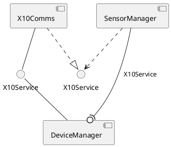

# Component Diagrams

## Purpose

- Design planned software components and the interfaces between them
- Demonstate how proven components can be integrated into the design
- Show how the services components provide through their interfaces are delegated to classes or to sub-components

### Components and Interfaces
- Software components are responsible to cohesive areas of funcitonality in the system
- They expose the functionality through interfaces
- Allow components to be wired together through interfaces

### Show Component Integration
- Organization may have existing components or use commercial off-the-shelf (COTS) components
- Component diagrams show client the components that use these components and the interfaces they must conform to

### Show Delegation of Services
- Components may be build up of sub-components
- Services they provide are delegated to instances of sub-components, or at a lower level to objects

## Basic Notation of Component Diagrams
- Components
- Interfaces
- Dependencies

### Components
- Modular, substitutable units of software that communicate through defined interfaces
- Shown as a rectange like a class with the stereotype `<<component>>`or the component icon or both
- Most tools use just the icon

### Interfaces
- A provided interface is how a component exposes its funcitonality to the outside world
    - Shown as a ball (lollipop)
- A required interface is an interface that a component needs to use, that matches a provided interface
    - Shown as a socket
- An interface can be shown with the operations that it provides
- The component that provides the interface is shown with a realization relationship to it
    - An dashed arrow
- The component that requires the interface is shown with a `<<use>>` dependency

### Dependencies
- Where the interface is not know, general dependencies between components can be shown
- It is also possible to show dependencies between reuired and provided interfaces

## Internal Structure of Components
- Realization
- Ports
- Delegation

### Realization
- Components are relaized by other components or by classes
- They provide the implementation
- Can be shown as a list, with realization relationships or in a compartment

### Ports
- A port on a component defines an interaction point between the component and its envrionment or the classifiers that relaize it
- Shown as a square on the edge
- The port may be dependent on the realizing classifiers

### Delegation
- Responsibility for implementation of an interface can be delegated to instances of the realizing classifiers in a composite structure diagram