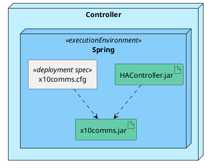

# Deployment Diagrams

## Purpose
- Model physical hardware components and the communication paths between them
- Document the deployment of software artifacts onto hardware nodes
- Plan the technical architecture of the system
- Model architecture as types or instances

### Physical Hardware
- Hardware is shown in deplyoment diagrams as nodes and devices
- These are elements with computational power
- They are linked together with communication paths

### Software Deployment
- Execution environments show containers like application servers and virtual machines
- Artifacts show physical software collections like jar files or assemblies
- Artifacts manifest components
- The artifacts is the physical file that will be deployed onto a node or device

### Technical Architecture
- Shows the relationships between physical hardware elements and between hardware and software
- Shows communication and dependencies between elements

### Types and Instances
- One can show either generic types or real instances in a deployment diagram

## Basic Notation of Deployment Diagrams
- Nodes
- Devices
- Communcation Paths

### Nodes 
- A computational resource onto which software (in the form of artifacts) can be deployed
- Shown by a cuboid
- Can be a type or an instance

### Device
- A physical computational resource onto which software can be deployed (subtype of node)
- Can be complex: can consist of other devices
- Shown as a cuboid stereotyped as `<<device>>`
- Can be a type or an instance

### Comuncation Path
- An association between nodes through which they can exchange signals or messages
- Shown as an association
- May be stereotyped with the type of communcation supported

```plantuml
skinparam node {
    BackgroundColor LightBlue
    BackgroundColor<<device>> White
}

node Controller as Ctrl
node X10Network as Netw
node PCClient <<device>> as PC
node OnOffDevice <<device>> as OOD
node InductinSensor <<device>> as ID
node OpenCloseDevice <<device>> as OCD

PC -- Ctrl: <<TCP/IP>>
Ctrl - Netw
Netw - OOD: <<X10>>
Netw -- ID: <<X10>>
Netw -- OCD: <<X10>>
```

## Software in Deployment Diagrams
- Execution Environments
- Artifacts
- Artifacts and Components
- Deploying Artifacts

### Execution Environments
- A node that provides an environment in which executable artifacts may be deployed
- A container fro software to run in
- Shown by a cuboid with the stereotype `executionEnvironment`
- Can be a type or an instance

### Artifacts
- Artifacts are physical pieces of infromation produced as part of a software development process
- Source files, Scripts, executables, database tables, help files
- Shown as a rectangle with the stereotype `<<artifact>>`, a document icon or both

## Artifacts and Components
- Artifacts are the physical manifestation of software components
- Shown linked to components with a `<<manifest>>` dependency

```plantuml
artifact HARemote.apk as A
component HARemote as C 

A .> C
```

### Deploying Artifacts
- Artifacts are deployed onto nodes (devices or execution environments)
- Can be shown as a list, graphically included or with a `<<deploy>>` dependency

### Deployment Specifications
- Provide a specification of properties required for the deployment of an artifact
- Shown as a rectangle with the stereotype `<<deployment spec>>`
- Linked to artifact with a dependency

